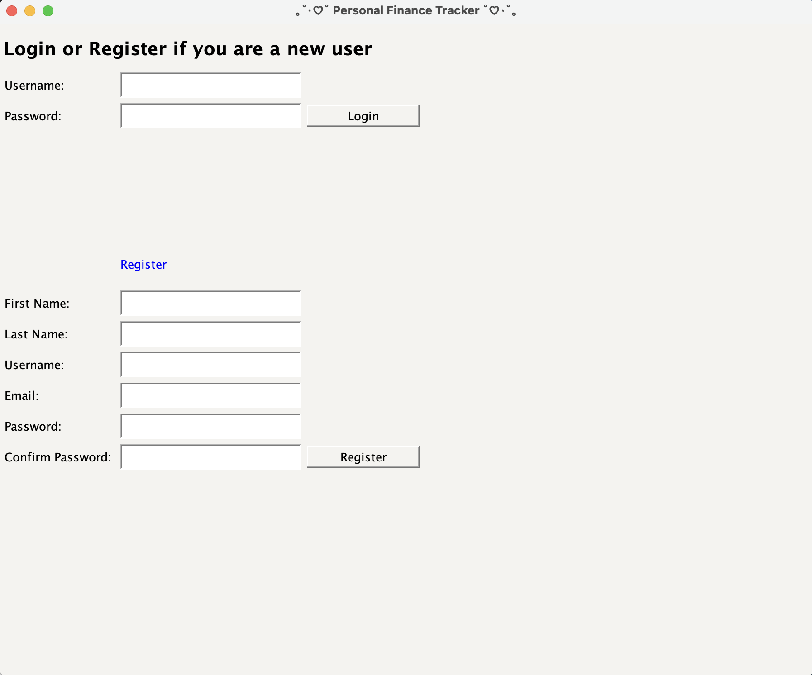
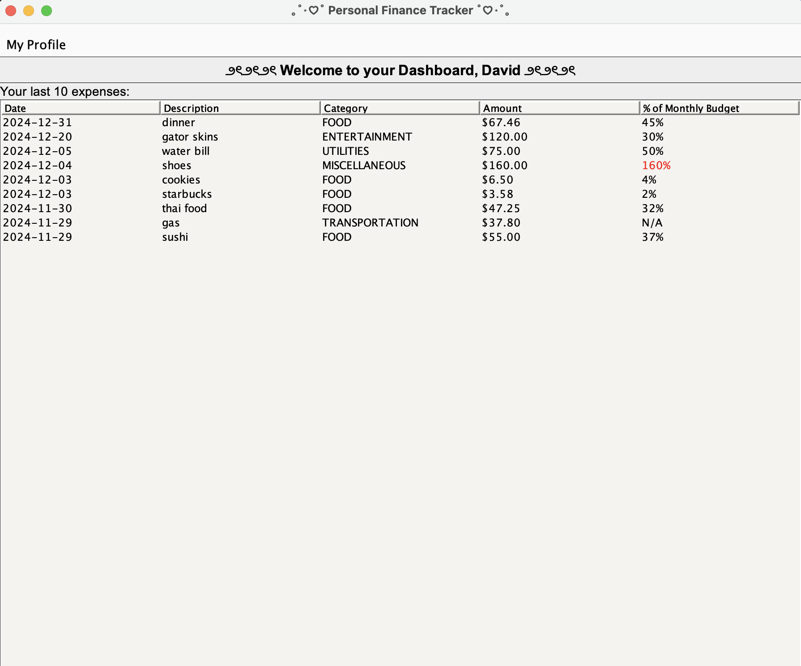
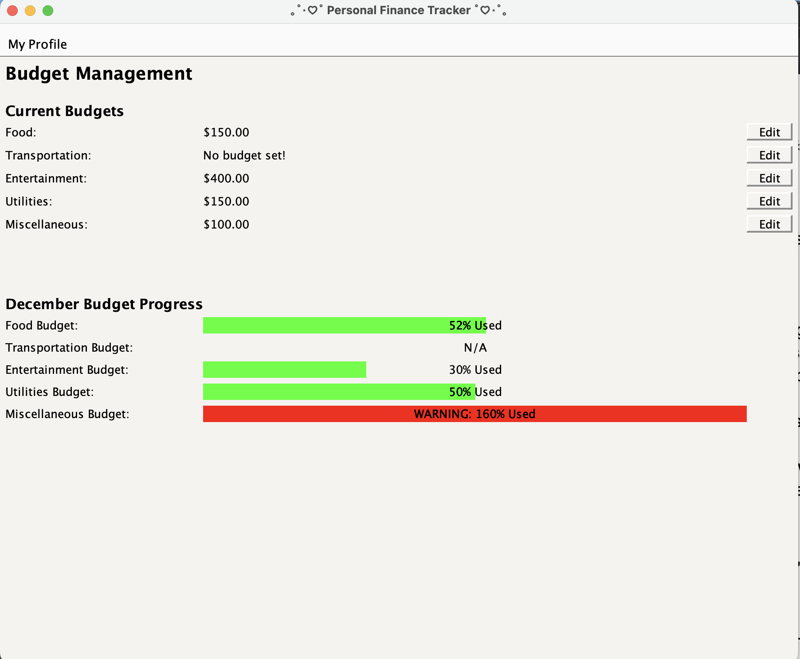
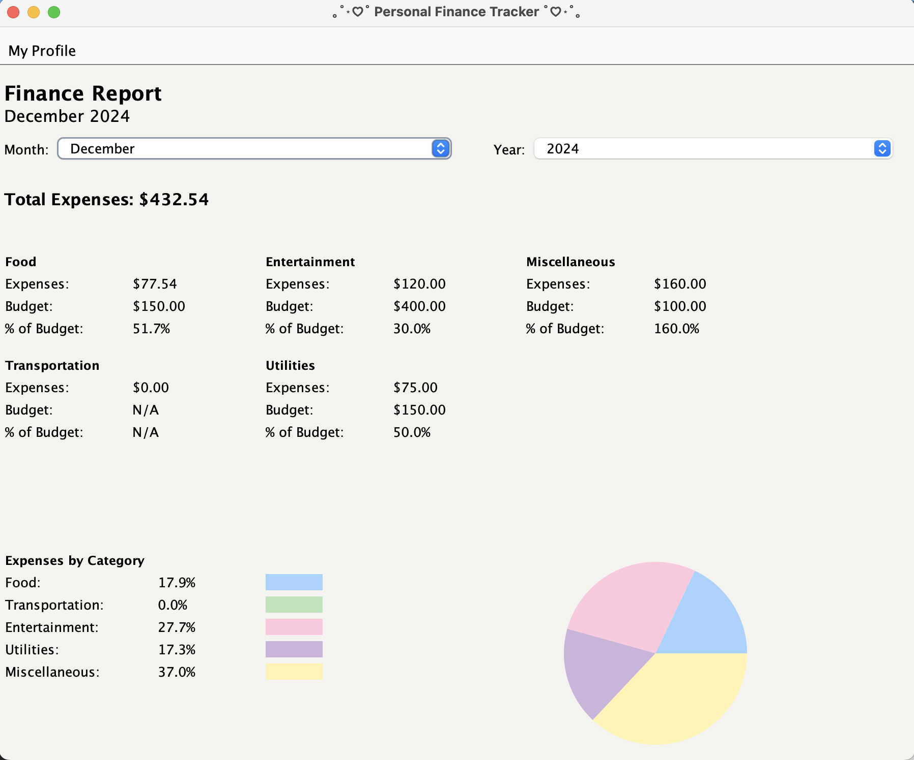

# Personal Finance Assistant

The Personal Finance Assistant is a software application designed to help users track expenses, manage budgets, and visualize financial data.

## Description

The project was built using object-oriented programming principles and Swing GUI. The program has user management, which controls the login and registration system. Expense tracking allows users to add, edit, and delete their expenses. Budget management, allows users to create monthly budgets based on different expense categories. Financial reports, which generate a monthly spending summary. It also supports import/export in a standardized format.

## Table of Contents

- [Technologies](#technologies)
- [Getting Started](#started)
- [Preview](#preview)
- [Credits](#credits)

## Technologies

- Java (version 17)
- Java Swing

## Getting Started {#started}

To run The Personal Finance Assistant, follow these steps:

_Prerequisites_

1. Download Java, version 17 or newer is recommended

- [oracle](https://www.oracle.com/java/technologies/downloads/)

_Program Execution Guide_

1. Either download the zip file or clone the repository
2. Go to the project folder through your preferred IDE or terminal
3. Compile the program with javac View.java
4. Run the program with Java View
5. Create a user in the login window (or log in if you already have an account)
6. The first page is the user Dashboard, which gives an overview of the last 10 expenses added and alerts the user to any spending over set budget limits. The menu bar has options for viewing expenses, budget, or finance views.
7. Options to import expense files are available on the expense page once the user is logged in. To do this, ensure a txt file is inside the main folder (it should be outside the src folder in Eclipse). List expense items in the form 'YYYY-MM-DD, Food,50.0, Description', with one expense per line in the text file.
8. The user can add an expense with the + button in the Expense page, or edit an expense from the Expense page by clicking on the expense and editing the expense in the popup window.
9. User can delete an expense by clicking on the expense and clicking the delete button in the popup window.
10. User can search for expenses based on category, date range, or both in the expense view page
11. User can add or update monthly budgets for each of the five categories on the budget page.
12. User can view a finance report that details monthly spending habits.
13. Program allows for multiple users to utilize the program by registering different users.
14. Data for users is saved within the folder in a .dat file. All data is written to the file on exit and uploaded when the program runs.

## Preview

Below are several screenshots of the Personal Finance Assistant application:
The main login page:

The user's personal dashboard showing last 10 monthly purchases

The expense page where user can add, edit or delete an expense. Import and export features are found here.

Users current montly budget and progress bars indicating amout of budget used

The Finance page, where user's find a montly breakdown of spending habits

## Credits

[Elle Knapp](https://github.com/dmknapp2385)  
[David Herring](https://github.com/davidherring)  
[Paulina Aguirre](https://github.com/paulinaa3)  
[Chitrangada Juneja](https://github.com/chitrangada-juneja)
